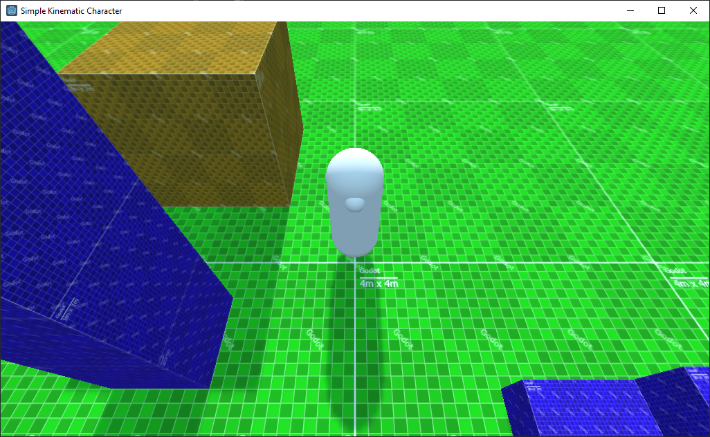

Simple kinematic character for Godot
====================================

This sample project attempts to implement a very simple 3D character that moves along a set path but where the path only controls the horizontal movement of the character.
This allows to make a semi 3D platformer.

License
-------
Released under MIT license, see LICENCE

Textures were created with: https://wahooney.itch.io/texture-grid-generator
BIG shoutout to wahooney
